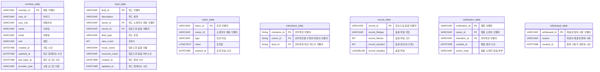

```mermaid
erDiagram
    member_table{
        VARCHAR member_id PK "회원 식별자"
        VARCHAR user_id "아이디"
        VARCHAR user_info "비밀번호"
        VARCHAR name "닉네임"
        VARCHAR email "이메일"
        VARCHAR role "권한"
        DATETIME created_at "가입 시간"
        DATETIME updated_at "최근 업데이트 시간"
        DATETIME last_login_at "최근 로그인 시간"
        VARCHAR provider_type "소셜 로그인 타입" 
        }

%%    member_table || -- o{ feed_table : "Member(1):Feed(N)"
    feed_table{
        VARCHAR feed_id PK "피드 식별자"
        VARCHAR description "피드 설명"
        VARCHAR owner_id FK "피드 소유자의 회원 식별자"
        VARCHAR record_id FK "업로드된 음원 식별자"
        VARCHAR feed_type "피드 유형"
        INT view_count "조회수"
        VARCHAR music_name "업로드한 음원 이름"
        VARCHAR musician_name "업로드한 음원 아티스트"
        DATETIME created_at "피드 생성 시간"
        DATETIME updated_at "피드 업데이트 시간" 
        }

%%    token_table ||--|| member_table : "1:1"
    token_table{
        VARCHAR token_id PK "토큰 식별자"
        VARCHAR owner_Id "소유자의 회원 식별자"
        VARCHAR type "토큰 타입"
        LONGTEXT value "토큰값"
        DATETIME expired_at "토큰 만료 시간"
    }

%%    interaction_table }o -- o| member_table : ""  
%%    interaction_table || -- o{ feed_table : ""
    interaction_table{
        String interation_id PK "인터렉션 식별자"
        String owner_id FK "인터렉션을 수행한 회원의 식별자"
        String feed_id FK "인터렉션 대상 피드의 식별자"
    }

%%    record_table || -- || feed_table : ""
    record_table{
        VARCHAR record_id PK "업로드된 음원 식별자"
        VARCHAR record_filetype "음원 파일 타입"
        INT record_filesize "음원 파일 크기"
        INT record_duration "음원 길이(초 단위)"
        LONGBLOB record_rawdata "음원 파일"
    }

%%    notification_table }o -- || member_table : ""
    notification_table{
        VARCHAR notification_id PK "알림 식별자"
        VARCHAR owner_id FK "알림 소유자 식별자"
        VARCHAR interation_id PK "인터렉션 식별자"
        DATETIME created_at "알림 생성 시간"
        VARCHAR owner_read "알림 소유자 읽음 여부"
    }
    
    withdrawal_table{
        VARCHAR withdrawal_id PK "제출된 탈퇴 사유 식별자"
        VARCHAR reason "회원이 제출한 탈퇴 사유"
        DATETIME created_at "탈퇴 사유가 생성된 시간"
    }
```